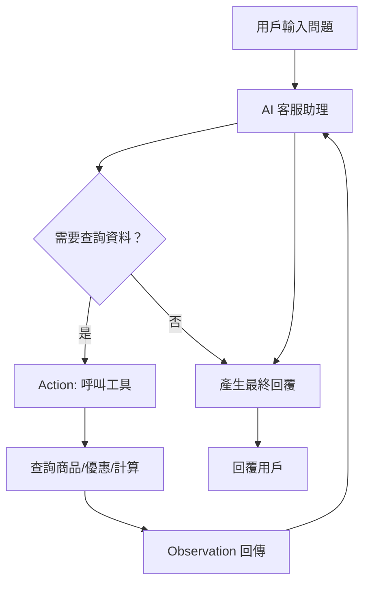

# ReAct AI 客服助理專案

## 專案說明

本專案為一個智慧型電商客服助理，結合大型語言模型（如 OpenAI GPT 或 Ollama）與自訂工具，能即時回應顧客關於商品、優惠政策、價格計算等諮詢。系統可根據用戶問題自動查詢商品資料庫、讀取優惠政策文件並計算最終交易價格，並以繁體中文回覆。

---

## 系統核心重點

- **多模型支援**：可切換使用 OpenAI GPT 或本地 Ollama 模型。
- **工具呼叫機制**：AI 會根據問題自動呼叫**查詢商品** (`query_by_product_name`)、**讀取優惠** (`read_store_promotions`)、**計算價格** (`calculate`)等工具。
- **ReAct 流程**：採用 Thought → Action → Observation → Answer 的推理流程，確保回覆具備邏輯與依據。
- **資料來源整合**：整合 SQLite 商品資料庫與優惠政策文字檔，資訊即時查詢。
- **可擴充性**：工具模組化設計，方便日後擴充新功能。

---

## 整體流程（Flow）與資料傳遞

1. **用戶輸入問題**  
   例：「請問有賣足球嗎？現在有什麼優惠？如果我現在買，最後多少錢？」

2. **AI 分析問題**  
   - 進入 Thought → Action → Observation 迴圈
   - 依需求呼叫對應工具（如查詢商品、讀取優惠、計算價格）

3. **工具執行**  
   - `query_by_product_name`：查詢 SQLite 商品資料庫
   - `read_store_promotions`：讀取優惠政策文字檔
   - `calculate`：計算最終交易價格

4. **Observation 回傳**  
   - 工具回傳查詢結果或計算結果給 AI

5. **AI 統整資訊並產生最終回覆**  
   - 以「Answer:」格式回覆用戶，並以繁體中文呈現

---

## 原理圖（Schematics）



---

## 如何設定並啟動

### 1. 安裝相依套件

請先安裝 Python 3.11+，並於專案根目錄執行：

```sh
pip install -r requirements.txt
```

### 2. 設定環境變數

請於 `.env` 檔案填入你的 OpenAI API 金鑰或 Ollama 伺服器資訊，例如：

```
API_KEY="你的 OpenAI API 金鑰"
OLLAMA_BASE_URL="http://localhost:11434"
```

### 3. 初始化資料庫與優惠政策

執行以下指令以建立商品資料庫與優惠政策檔案：

```sh
python tools/query_product_data.py
python tools/read_promotions.py
```

### 4. 啟動主程式

於專案根目錄執行：

```sh
python main.py
```

即可開始與 AI 客服助理互動。

---

## 目錄結構

- `main.py`：主程式，負責用戶互動與流程控制
- `agent.py`：AI 客服助理核心邏輯
- `op_llm_client.py`：Ollama LLM 客戶端
- `tools/`：工具模組（查詢商品、計算價格、讀取優惠）
- `config.json`：模型與系統設定
- `requirements.txt`：相依套件清單

---

## 範例互動流程

```
請輸入您的問題，或輸入『退出』結束: 請問有賣足球嗎？有什麼優惠？
客服回覆：根據您的詢問，我們有販售足球，目前價格為120元。現正享有購買足球9折優惠，若您現在購買，最終交易價格為108元。
```

---

## 其他

- 若需切換模型，請調整 `config.json` 內 `use_model` 參數。
- 工具模組可於 `tools/` 目錄擴充。
- 詳細原理與流程請參考上方原理圖與說明。

---
